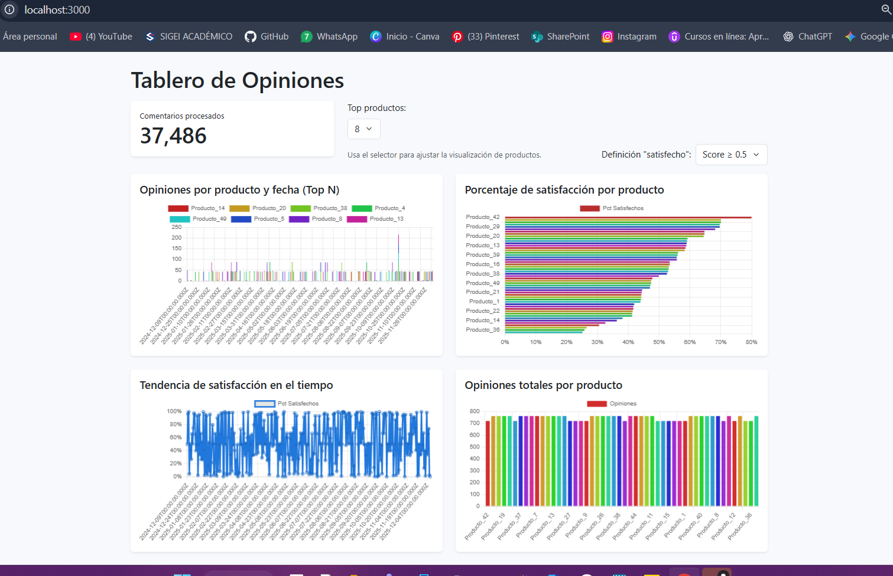
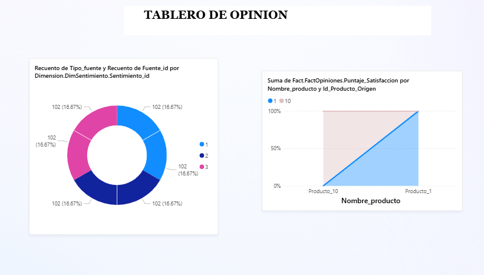
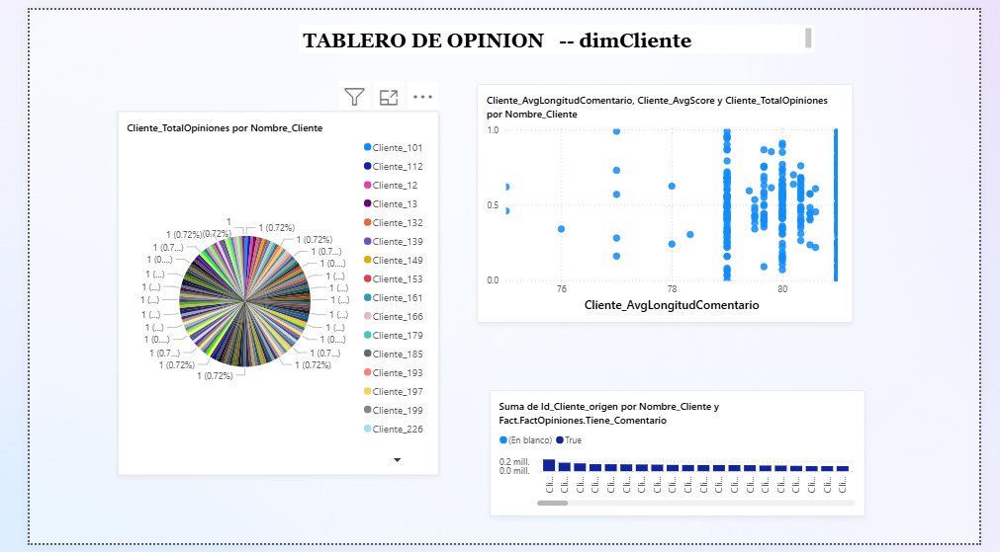
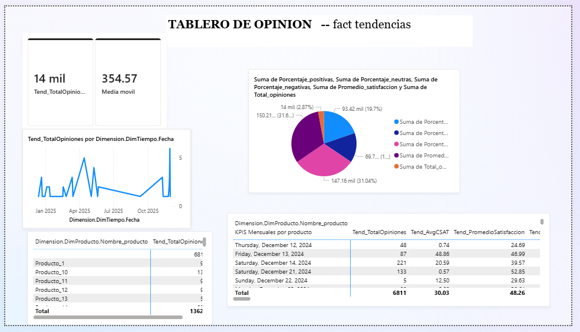
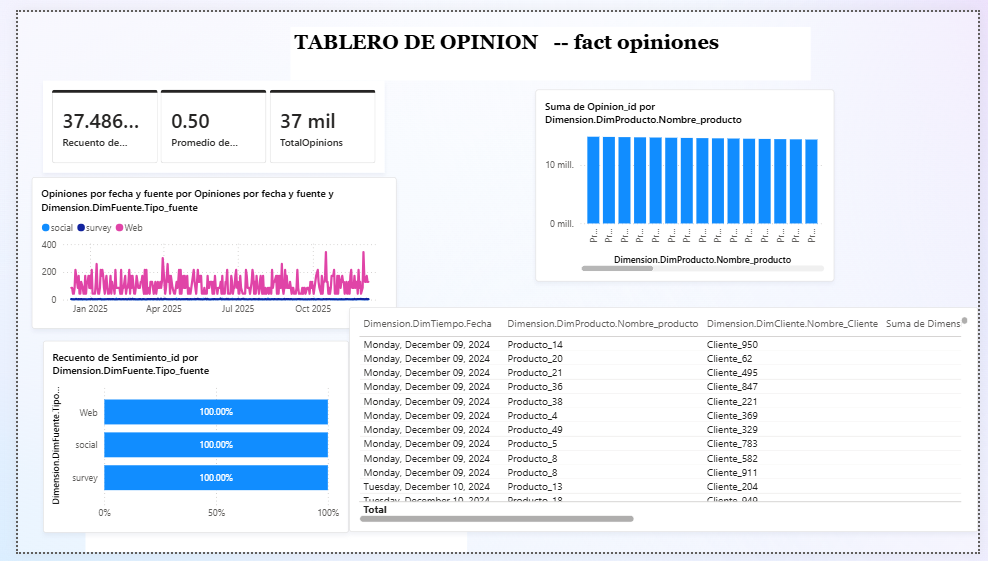

# Sistema de Análisis de Opiniones

Resumen
-------
Este repositorio contiene un pipeline ETL que extrae opiniones de clientes desde fuentes locales (CSV / base origen / API), normaliza y carga dimensiones y hechos en un Data Warehouse pensado para alimentar un dashboard con KPIs auditables.

**DASHBOARD INDICADORES APP WEB**
-------

**TABLERO POWER BI**
-------

**LINK:* (https://app.powerbi.com/links/eOguXJD7Lu?ctid=9156d3bf-d39d-42cb-abf6-b7deca4a0892&pbi_source=linkShare)**

